# 🗺️ Esquema Visual de la Campaña Chronosia
## *Diagrama de Flujo Principal - Vista General*

---

> **📖 NAVEGACIÓN:**
> - [Diagrama Principal](#-diagrama-principal-de-la-campaña) (este archivo)
> - [📊 Opciones en Sandbox](./00_Esquemas/01_Sandbox.md) - Detalle de exploración libre
> - [⚔️ La Ascensión del Cónclave](./00_Esquemas/02_Ascension_Conclave.md) - Sistema de competencia
> - [🏰 Torre de la Eternidad](./00_Esquemas/03_Torre_Eternidad.md) - Asalto final y finales
> - [🎭 Decisiones Críticas](./00_Esquemas/04_Decisiones_Criticas.md) - Puntos de elección clave

---

## 📊 **DIAGRAMA PRINCIPAL DE LA CAMPAÑA**

Este diagrama muestra el flujo completo de la campaña desde el inicio hasta los cuatro finales posibles.

```mermaid
flowchart TD
    START([Inicio: Waterdeep<br/>Nivel 3]) --> FASE0[FASE 0: RAILROAD INICIAL<br/>Sesiones 1-3]
    
    FASE0 --> S1[Sesión 1: Asesinato<br/>Kaelthas derrotado]
    S1 --> S2[Sesión 2: Llegada a Chronosia<br/>Cronópolis como base]
    S2 --> S3[Sesión 3: Primera Misión<br/>Exploración inicial]
    
    S3 --> FASE1[FASE 1: ROBOS Y TRAICIÓN<br/>Sesiones 4-6]
    
    FASE1 --> S4[Sesión 4: Robo del Cronómetro<br/>Edward Teach actúa]
    S4 --> S4A{¿PJ investigan?}
    S4A -->|Sí| S4B[Sesión 4-5: Robo de la Perla<br/>Nautilus traicionados]
    S4A -->|No| S4C[PJ pierden pista]
    S4B --> S5[Sesión 5: Creación del Talismán<br/>¿PJ interrumpen?]
    S4C --> S5
    
    S5 --> S5A{¿PJ interrumpen ritual?}
    S5A -->|Sí| S5B[Talismán NO creado<br/>Final B imposible]
    S5A -->|No| S5C[Talismán creado<br/>Final B posible]
    
    S5B --> S6A[Sesión 5-6: Asesinato de Thyra<br/>Edward Teach gana poder]
    S5C --> S6A
    
    S6A --> S6B{¿PJ salvan a Thyra?}
    S6B -->|Sí| ALT1[ALTERNATIVA: Thyra viva<br/>Campaña cambia drásticamente]
    S6B -->|No| S6[Sesión 6: Caos Desencadenado<br/>Guerra espontánea comienza]
    
    ALT1 --> FASE2
    S6 --> FASE2[FASE 2: SANDBOX INICIAL<br/>Sesiones 6-9]
    
    FASE2 --> S7[Sesión 6-7: Exploración Libre<br/>6 regiones desbloqueadas]
    S7 --> SAND_DETAIL[📊 Ver detalle Sandbox]
    SAND_DETAIL -.->|Enlace| SAND_LINK[./00_Esquemas/01_Sandbox.md]
    S7 --> S8[Sesión 8: Primera Sospecha<br/>¿Dónde está Manshoon?]
    S8 --> S8A[🤝 Contador del Ritual<br/>Anacronistas + Relojeros Negros]
    S8A --> S9[Sesión 9: Exploración Avanzada<br/>9 regiones desbloqueadas]
    
    S9 --> FASE3[FASE 3: SANDBOX AVANZADO<br/>Sesiones 9-12]
    
    FASE3 --> S10[Sesión 10: Algo Está Mal<br/>Revelación sobre ritual]
    S10 --> S11[Sesión 11: Momento de Elección<br/>Varrak elige bando]
    S11 --> ASC_DETAIL[⚔️ Ver Ascensión del Cónclave]
    ASC_DETAIL -.->|Enlace| ASC_LINK[./00_Esquemas/02_Ascension_Conclave.md]
    
    S11 --> S11A{¿Varrak se une a PJ?}
    S11A -->|Aliado| S11B[Varrak ayuda a PJ<br/>+3 puntos aliados]
    S11A -->|Enemigo| S11C[Varrak se une a Vorthak<br/>+5 puntos enemigos]
    S11A -->|Mártir| S11D[Varrak se sacrifica<br/>Poder épico a PJ]
    
    S11B --> S12
    S11C --> S12
    S11D --> S12[Sesión 12: El Ritual<br/>Ritual al 92%]
    
    S12 --> FASE4[FASE 4: CLÍMAX<br/>Sesiones 13-15]
    
    FASE4 --> S13[Sesión 13: Llamada de los Dioses<br/>Ritual al 98%]
    S13 --> S14[Sesión 14: Asalto a la Torre<br/>5 niveles de la Torre]
    S14 --> TORRE_DETAIL[🏰 Ver Torre de la Eternidad]
    TORRE_DETAIL -.->|Enlace| TORRE_LINK[./00_Esquemas/03_Torre_Eternidad.md]
    
    S14 --> S14A{¿Edward Teach tiene Talismán?}
    S14A -->|Sí| S14B{¿Teach llegó primero?}
    S14A -->|No| FINAL_A[FINAL A: Manshoon Ascendente<br/>Ritual al 98-99%]
    
    S14B -->|Sí| FINAL_B[FINAL B: Blackbeard Usurpador<br/>Teach intercepta poder]
    S14B -->|No| FINAL_A
    S14B -->|Simultáneo| FINAL_C[FINAL C: Carrera Divina<br/>3 bandos luchan]
    
    S14 --> S15A{¿Ritual al 100%?}
    S15A -->|Sí| FINAL_D[FINAL D: Demasiado Tarde<br/>Manshoon invencible]
    S15A -->|No| S15[Sesión 15: Destino del Multiverso<br/>Combate final]
    
    FINAL_A --> EPILOGO[Epílogo: Consecuencias<br/>Destino de Chronosia]
    FINAL_B --> EPILOGO
    FINAL_C --> EPILOGO
    FINAL_D --> EPILOGO
    
    EPILOGO --> END([Fin de Campaña<br/>Nivel 15])
    
    style FASE0 fill:#e1f5ff
    style FASE1 fill:#ffe1f5
    style FASE2 fill:#fff5e1
    style FASE3 fill:#e1ffe1
    style FASE4 fill:#ffe1e1
    style FINAL_A fill:#ffcccc
    style FINAL_B fill:#ccffcc
    style FINAL_C fill:#ccccff
    style FINAL_D fill:#ffccff
    style SAND_DETAIL fill:#fff5e1,stroke:#ffaa00,stroke-width:3px
    style ASC_DETAIL fill:#ffffcc,stroke:#ffaa00,stroke-width:3px
    style TORRE_DETAIL fill:#ffe1e1,stroke:#ffaa00,stroke-width:3px
```

---

## 🔗 **ENLACES A DIAGRAMAS DETALLADOS**

### **📊 [Opciones en Sandbox](./00_Esquemas/01_Sandbox.md)**
Exploración libre de regiones temporales y dimensionales, sistema de balance crítico, y consecuencias del desequilibrio.

### **⚔️ [La Ascensión del Cónclave](./00_Esquemas/02_Ascension_Conclave.md)**
Formación de bandos tras el asesinato de Thyra, sistema de puntos de ascensión, eventos aleatorios, y elección de Supremos.

### **🏰 [Torre de la Eternidad](./00_Esquemas/03_Torre_Eternidad.md)**
Los 5 niveles del asalto final, condiciones para cada uno de los 4 finales posibles, y mecánicas del combate final.

### **🎭 [Decisiones Críticas](./00_Esquemas/04_Decisiones_Criticas.md)**
Los 6 puntos de decisión que determinan el curso de la campaña y afectan directamente el desenlace final.

---

## 📋 **LEYENDA RÁPIDA**

### **Colores por Fase:**
- 🔵 **Azul claro (FASE 0)**: Railroad inicial - Establecimiento del mundo
- 🔴 **Rosa (FASE 1)**: Robos y traición - Eventos catalizadores
- 🟡 **Amarillo (FASE 2)**: Sandbox inicial - Exploración libre
- 🟢 **Verde (FASE 3)**: Sandbox avanzado - Revelaciones y elecciones
- 🔴 **Rojo (FASE 4)**: Clímax - Confrontación final

### **Finales Posibles:**
- **FINAL A (Rojo)**: Manshoon Ascendente - El villano completa su plan
- **FINAL B (Verde)**: Blackbeard Usurpador - Edward Teach intercepta el poder
- **FINAL C (Azul)**: Carrera Divina - Combate de tres bandos
- **FINAL D (Rosa)**: Demasiado Tarde - Manshoon ya ascendió (mal final)

### **Eventos Fijos vs Variables:**
- **Eventos Fijos** (ocurren siempre): Asesinato en Waterdeep, Robo del Cronómetro, Asesinato de Thyra, Reacción Espontánea, Elección de Varrak, Llamada de los Dioses
- **Eventos Variables** (dependen de los PJ): Orden de enfrentamiento de lugartenientes, Alianzas, Revelaciones tempranas, Interrupciones de eventos

---

*Este es el diagrama principal de la campaña. Usa los enlaces arriba para navegar a diagramas más detallados de cada fase o sistema.* ⏰✨
