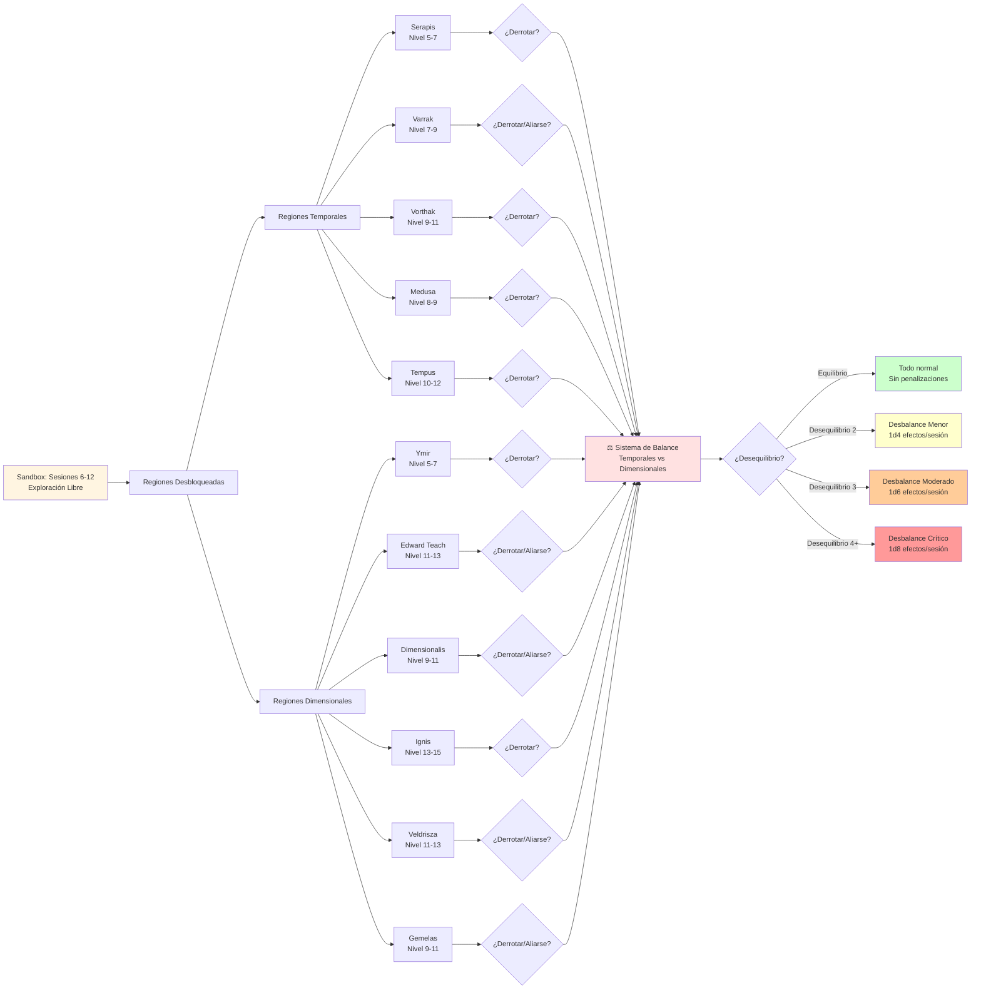

# 📊 Opciones en Sandbox
## *Exploración Libre y Sistema de Balance*

---

> **📖 NAVEGACIÓN:**
> - [← Volver al Diagrama Principal](../00_Esquema_Campana_Mermaid.md)
> - [⚔️ La Ascensión del Cónclave](./02_Ascension_Conclave.md)
> - [🏰 Torre de la Eternidad](./03_Torre_Eternidad.md)
> - [🎭 Decisiones Críticas](./04_Decisiones_Criticas.md)

---

## 🎯 **DIAGRAMA DETALLADO: OPCIONES EN SANDBOX**

Este diagrama muestra todas las opciones de exploración durante las Sesiones 6-12, incluyendo las regiones temporales y dimensionales, y cómo las decisiones afectan el sistema de balance crítico.

---

## 📋 **INFORMACIÓN DETALLADA**

### **⚖️ Sistema de Balance Crítico**

**Balance Inicial:**
- **Temporales Principales:** 3 (Serapis, Varrak, Vorthak)
- **Dimensionales Principales:** 5 (Teach, Dimensionalis, Ignis, Veldrisza, Gemelas)
- **Ya hay desequilibrio** favorable a lo dimensional (3 vs 5)

**Cálculo del Desbalance:**
- **Diferencia = |Temporales Derrotados - Dimensionales Derrotados|**
- **Ejemplo:** Si derrotan 2 temporales y 0 dimensionales → Diferencia = 2 (Desbalance Moderado)

### **🔴 Niveles de Desbalance:**

#### **🟢 EQUILIBRIO (Diferencia 0-1)**
- **Estado:** Todo funciona normalmente
- **Cronópolis:** Completamente seguro y estable
- **Viajes:** Sin problemas, portales funcionan al 100%
- **Descanso:** Descanso largo disponible sin restricciones

#### **🟡 DESBALANCE MENOR (Diferencia 2)**
- **Lanzamientos:** 1d4 efectos por sesión
- **Momento:** Al inicio de cada sesión
- **Efectos:** Ver [Tabla de Efectos por Desbalance](../../06_Recursos/Tablas/19_Tablas_Eventos.md#-tabla-de-efectos-por-desbalance)

#### **🟠 DESBALANCE MODERADO (Diferencia 3)**
- **Lanzamientos:** 1d6 efectos por sesión
- **Momento:** Al inicio + cada 2 horas
- **Efectos:** Ver [Tabla de Efectos por Desbalance](../../06_Recursos/Tablas/19_Tablas_Eventos.md#-tabla-de-efectos-por-desbalance)

#### **🔴 DESBALANCE CRÍTICO (Diferencia 4+)**
- **Lanzamientos:** 1d8 efectos por sesión
- **Momento:** Al inicio + cada hora + eventos importantes
- **Efectos:** Ver [Tabla de Efectos por Desbalance](../../06_Recursos/Tablas/19_Tablas_Eventos.md#-tabla-de-efectos-por-desbalance)
- **⚠️ ACCIÓN ESPECIAL:** Si el balance alcanza desbalance crítico (diferencia de 4+), Varrak del Horizonte (probablemente aliado de los PJ) se quitará la vida voluntariamente para equilibrar los poderes y evitar la catástrofe cósmica. Ver [02_Varrak_El_Oraculo.md](../../02_Guia_DM/04_Cronofagos_Detallado/02_Varrak_El_Oraculo.md) para detalles.

### **🎯 Estrategia Recomendada:**

**Para mantener el equilibrio:**
- Derrotar al menos 2 dimensionales antes de enfrentar más temporales
- Alternar entre temporales y dimensionales cuando sea posible
- Considerar alianzas en lugar de derrotas cuando el balance esté en riesgo

**Lugartenientes con opciones de alianza:**
- **Varrak** (Sesión 11): Puede unirse a los PJ
- **Edward Teach**: Puede negociar (peligroso)
- **Dimensionalis**: Puede vender información
- **Las Gemelas**: Pueden aliarse según circunstancias
- **Veldrisza**: Puede negociar (conexión con Jarlaxle)

---

*Este diagrama muestra cómo las decisiones de exploración afectan el balance crítico de Chronosia. Mantener el equilibrio es esencial para evitar catástrofes cósmicas.* ⚖️✨

