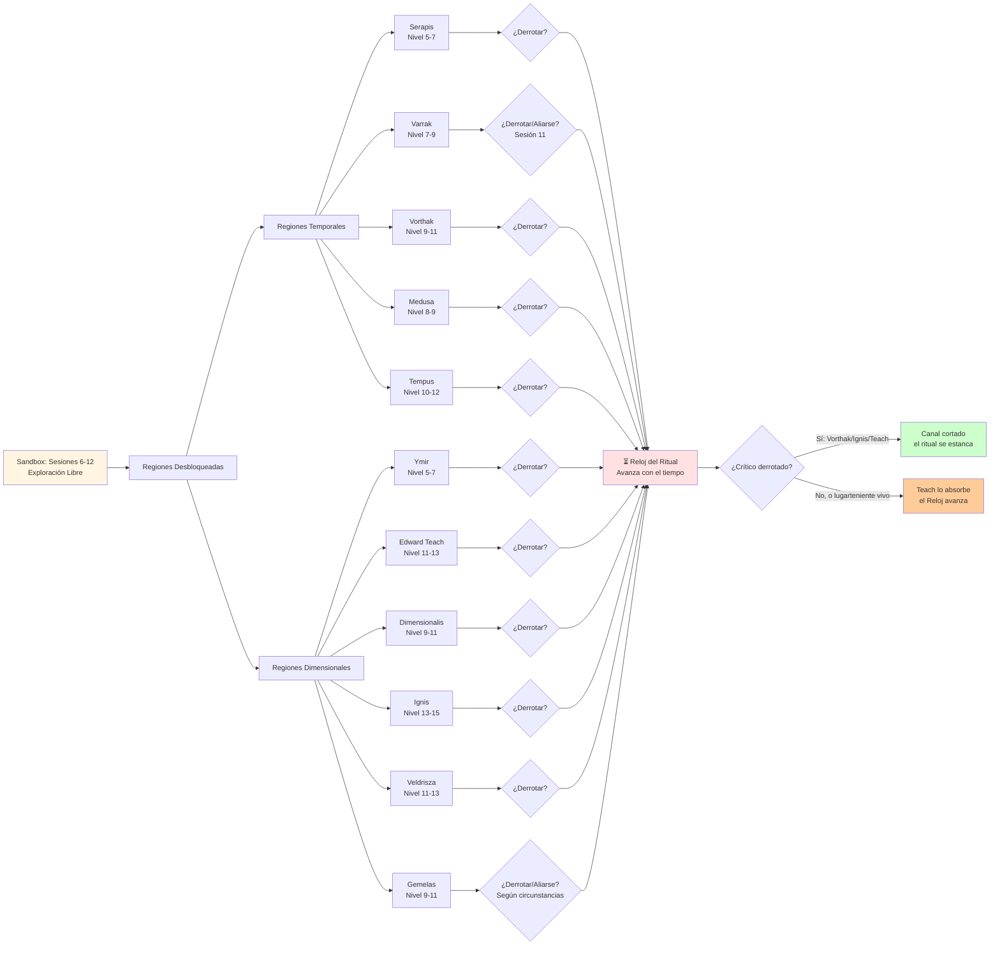

# 📊 Opciones en Sandbox
## *Exploración Libre y Sistema de Balance*

---

> **📖 NAVEGACIÓN:**
> - [← Volver al Diagrama Principal](../00_Esquema_Campana_Mermaid.md)
> - [⚔️ La Ascensión del Cónclave](./02_Ascension_Conclave.md)
> - [🏰 Torre de la Eternidad](./03_Torre_Eternidad.md)
> - [🎭 Decisiones Críticas](./04_Decisiones_Criticas.md)

---

## 🎯 **DIAGRAMA DETALLADO: OPCIONES EN SANDBOX**

Este diagrama muestra todas las opciones de exploración durante las Sesiones 6-12, incluyendo las regiones temporales y dimensionales, y cómo las decisiones afectan el sistema de balance crítico.

---

## 📋 **INFORMACIÓN DETALLADA**

> **Motor de presión: el Reloj del Ritual** (sustituye al antiguo sistema de balance temporal/dimensional, retirado). Detalle completo en [⏳ Motor de Campaña: Reloj y Puertas](../02_Guia_DM/10_Motor_de_Campana_Reloj_y_Puertas.md).

### **⏳ Cómo funciona el Reloj en el sandbox**

El Reloj del Ritual (8 segmentos, empieza en 2/8) avanza mientras los PJ exploran. **No da tiempo a todo: hay que elegir.**

- **Avanza** al explorar regiones (cada arco ≈ +1), con los hitos de Teach, y si dejan que Barbanegra absorba lugartenientes.
- **Se frena** al derrotar a un **crítico** (Vorthak, Ignis, Teach → corta un canal divino), con sabotaje de los Anacronistas, o con el **sacrificio de Varrak** (−1).
- **A 8** → Llamada de los Dioses → se abre la Torre (clímax).

### **🔮 El sacrificio de Varrak**

Si el **Reloj está crítico (≥6/8)** y Varrak es aliado de los PJ, puede sacrificarse para retroceder el Reloj un segmento (y revivir a Marcus). El gatillo ya no es el "desbalance", sino el Reloj + la relación construida con él. Ver [02_Varrak_El_Oraculo.md](../02_Guia_DM/04_Cronofagos_Detallado/02_Varrak_El_Oraculo.md).

### **🎯 Estrategia Recomendada:**

**Para no quedarse sin tiempo:**
- Prioriza a los **críticos** (frenan el Reloj); el resto, opcional
- No te entretengas: cada región consume tiempo
- Considera **alianzas** en vez de combates cuando convenga (Varrak, Gemelas)

**⚠️ IMPORTANTE - Opciones de Alianza con Lugartenientes:**

**Alianzas Reales (Pueden unirse a los PJ):**
- **Varrak** (Sesión 11): Puede unirse a los PJ si le dan esperanza, o unirse a Vorthak si lo traicionan, o sacrificarse
- **Las Gemelas**: Pueden aliarse con los PJ si demuestran que pueden cambiar la realidad

**Negociaciones (NO son alianzas formales):**
- **Edward Teach**: Puede negociar (peligroso, no es alianza)
- **Dimensionalis**: Puede vender información (no es alianza)
- **Veldrisza**: Puede negociar (conexión con Jarlaxle, no es alianza)

**Enemigos (Sin opción de alianza):**
- **Vorthak**: Enemigo declarado, ve a los PJ como amenaza directa
- **Serapis**: Subordinado leal de Vorthak
- **Ignis**: Líder del bando dimensional
- **Medusa, Tempus, Ymir**: Sin opciones de alianza documentadas

---

*Este diagrama muestra cómo las decisiones de exploración hacen correr el Reloj del Ritual. No da tiempo a todo: elegir bien a quién enfrentar es la esencia del sandbox.* ⏳✨

