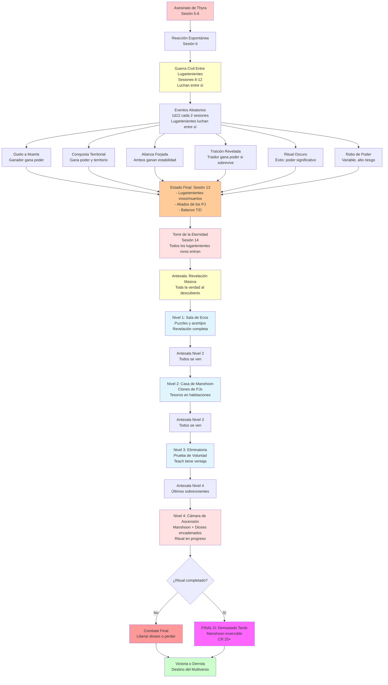

# ⚔️ La Ascensión del Cónclave
## *Sistema de Competencia Entre Lugartenientes*

---

> **📖 NAVEGACIÓN:**
> - [← Volver al Diagrama Principal](../00_Esquema_Campana_Mermaid.md)
> - [📊 Opciones en Sandbox](./01_Sandbox.md)
> - [🏰 Torre de la Eternidad](./03_Torre_Eternidad.md)
> - [🎭 Decisiones Críticas](./04_Decisiones_Criticas.md)

---

## ⚔️ **DIAGRAMA: LA ASCENSIÓN DEL CÓNCLAVE**

Este diagrama muestra cómo el asesinato de Thyra desencadena la guerra civil entre lugartenientes, y cómo todos los supervivientes llegan a la Torre de la Eternidad para el enfrentamiento final.

---

## 📋 **INFORMACIÓN DETALLADA**

### **🔮 La Verdad Detrás de la Competencia:**

**Lo que los Lugartenientes Creen:**
- Aethernus ha anunciado que solo 2-3 recibirán poder divino supremo
- Creen que están "demostrando su valía" para Aethernus

**La Verdad:**
- **Manshoon está RECLUIDO** ejecutando el ritual final para convertirse en dios
- **NO planeó esta competencia** - surgió orgánicamente después del asesinato de Thyra
- **La aprovechó como distracción** para mantener a sus lugartenientes ocupados
- **Edward Teach sospecha la verdad** y está investigando cómo robar el poder divino

### **⚔️ La Guerra Civil Entre Lugartenientes:**

Tras el asesinato de Thyra, los lugartenientes reaccionan espontáneamente. Algunos forman alianzas temporales, otros actúan solos, pero todos compiten por poder y supervivencia. Esta guerra civil es **orgánica y no planeada** - Manshoon ni siquiera sabe que está ocurriendo.

**Características:**
- **Lugartenientes luchan entre sí** por poder, territorio y supervivencia
- **Alianzas temporales** pueden formarse y romperse
- **Eventos aleatorios** determinan quién gana o pierde en cada conflicto
- **Todos los supervivientes** llegarán a la Torre de la Eternidad en Sesión 14
- **Edward Teach** siempre llega (tiene el Talismán, evento fijo)

### **📊 Competencia Narrativa Entre Lugartenientes:**

> **📊 Para tablas completas de tracking:**
> Consulta **[20_Tablas_Tracking_Campana.md](../../06_Recursos/Tablas/20_Tablas_Tracking_Campana.md)** para:
> - Estado de Lugartenientes (vivo/muerto/aliado)
> - Balance Temporal/Dimensional
> - Todas las demás tablas de tracking

**Resumen de Acciones y Efectos Narrativos:**

| **Acción** | **Efecto Narrativo** | **Ejemplos** |
|------------|---------------------|--------------|
| Asesinar a otro lugarteniente | Gana poder significativo y reputación | Edward Teach mata a Thyra |
| Conquistar región completa | Gana poder y control territorial | Ignis anexa Las Calderas |
| Debilitar significativamente a los PJ | Demuestra fuerza y elimina amenazas | Matar a un PJ, destruir aliados |
| Completar misión de Aethernus | Gana favor directo | Sacrificar 1000 almas |
| Formar alianza exitosa (3+ sesiones) | Gana estabilidad y poder conjunto | Vorthak + Serapis |
| Ritual de extracción divina | Gana poder divino significativo | Extraer poder directamente (1 vez) |
| Traicionar exitosamente | Demuestra astucia si sobrevive | Dimensionalis traiciona y sobrevive |
| Defender exitosamente de invasión | Demuestra fuerza y resistencia | Rechazar ataque de otro lugarteniente |

**Criterios para Supremos:**
- **Acciones Significativas:** Lugartenientes que han logrado múltiples victorias importantes
- **Poder Acumulado:** Aquellos que han robado o absorbido poder de otros
- **Dominio Territorial:** Lugartenientes que controlan múltiples regiones
- **Influencia:** Aquellos que han formado alianzas poderosas o han demostrado liderazgo

**Cuando alguien se vuelve Supremo (narrativamente):**
- Recibe automáticamente un fragmento de poder divino (poder x3, inmortalidad)
- **NO hay proclamación** - el poder fluye automáticamente al más fuerte
- Manshoon configuró el sistema así ANTES de recluirse, pero ahora NO sabe quién lo recibe
- Máximo 3 Supremos durante la campaña

**📖 Para eventos narrativos:** Ver [05_La_Ascension_del_Conclave.md](../../02_Guia_DM/05_La_Ascension_del_Conclave.md) para detalles completos sobre la competencia narrativa.

### **🎲 Eventos Aleatorios (1d12 cada 2-3 sesiones):**

Ver [05_La_Ascension_del_Conclave.md](../../02_Guia_DM/05_La_Ascension_del_Conclave.md) para la tabla completa de eventos aleatorios.

### **⚔️ Resolución Final y Repercusión en el Clímax:**

**Estado al Llegar al Clímax (Sesión 13-15):**
- **Lugartenientes vivos** (determinados por eventos de la campaña)
- **Aliados de los PJ** (si formaron alianzas)
- **Balance Temporal/Dimensional** (afecta dificultad del combate final)

**Todos los Lugartenientes Vivos Llegan a la Torre:**
- **Edward Teach** siempre llega (tiene el Talismán, evento fijo)
- **Otros lugartenientes vivos** también llegan (Vorthak, Ignis, etc. si están vivos)
- **En la Antesala** todos se ven y oyen, pero no pueden atacarse
- **Revelación masiva** en Nivel 1: toda la verdad al descubierto

**Impacto en el Combate Final:**
- **Lugartenientes aliados con PJ:** Actúan como NPCs aliados en el combate
- **Lugartenientes enemigos:** Pueden aparecer como refuerzos de Manshoon o como tercer bando
- **Edward Teach:** Siempre presente, determina el final según timing narrativo

**📊 Para tablas completas de resolución final:**
- Consulta [20_Tablas_Tracking_Campana.md](../../06_Recursos/Tablas/20_Tablas_Tracking_Campana.md#9-resolución-final-y-estado-para-el-clímax)
- Ver detalles completos en [05_La_Ascension_del_Conclave.md](../../02_Guia_DM/05_La_Ascension_del_Conclave.md#-resolución-de-la-lucha-de-poder-y-repercusión-en-el-clímax)

---

*Este sistema convierte la campaña de "derrotar 12 jefes secuencialmente" en "navegar una guerra civil cósmica donde cada decisión importa".* ⚔️✨

