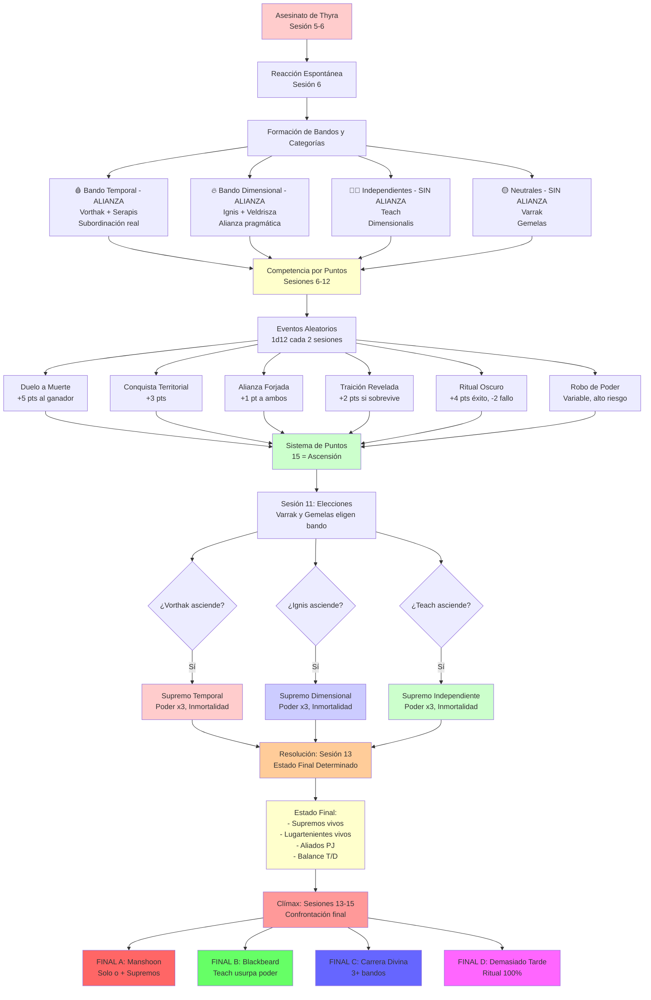

# ⚔️ La Ascensión del Cónclave
## *Sistema de Competencia Entre Lugartenientes*

---

> **📖 NAVEGACIÓN:**
> - [← Volver al Diagrama Principal](../00_Esquema_Campana_Mermaid.md)
> - [📊 Opciones en Sandbox](./01_Sandbox.md)
> - [🏰 Torre de la Eternidad](./03_Torre_Eternidad.md)
> - [🎭 Decisiones Críticas](./04_Decisiones_Criticas.md)

---

## ⚔️ **DIAGRAMA: LA ASCENSIÓN DEL CÓNCLAVE**

Este diagrama muestra cómo el asesinato de Thyra desencadena la competencia entre lugartenientes, la formación de bandos, y el sistema de puntos que determina quién asciende a Supremo.

---

## 📋 **INFORMACIÓN DETALLADA**

### **🔮 La Verdad Detrás de la Competencia:**

**Lo que los Lugartenientes Creen:**
- Aethernus ha anunciado que solo 2-3 recibirán poder divino supremo
- Creen que están "demostrando su valía" para Aethernus

**La Verdad:**
- **Manshoon está RECLUIDO** ejecutando el ritual final para convertirse en dios
- **NO planeó esta competencia** - surgió orgánicamente después del asesinato de Thyra
- **La aprovechó como distracción** para mantener a sus lugartenientes ocupados
- **Edward Teach sospecha la verdad** y está investigando cómo robar el poder divino

### **⚔️ Los Bandos y Categorías:**

#### **🩸 Bando Temporal - "Los Sedientos de Tiempo" (ALIANZA REAL)**
- **Líder:** Lord Vorthak "El Sediento Eterno"
- **Miembros:** Serapis el Retroceso (subordinado leal)
- **Varrak:** Neutral inicialmente, puede unirse en Sesión 11
- **Estrategia:** Drenaje temporal, conquista agresiva, subordinación por miedo
- **Objetivos:** Conquistar 3+ regiones, eliminar a Edward Teach, drenar poder dimensional
- **⚠️ IMPORTANTE:** Esta es una **ALIANZA REAL** - Vorthak y Serapis trabajan juntos

#### **🔥 Bando Dimensional - "Los Conquistadores de Planos" (ALIANZA REAL)**
- **Líder:** Ignis el Devorador Espacial
- **Miembros:** Matrona Veldrisza (aliada pragmática)
- **Las Gemelas:** Neutrales pero inclinadas, pueden unirse en Sesión 11
- **Estrategia:** Expansión metódica, red de portales, alianzas estratégicas
- **Objetivos:** Conectar todas las regiones con portales, alianzas con planos externos
- **⚠️ IMPORTANTE:** Esta es una **ALIANZA REAL** - Ignis y Veldrisza trabajan juntos

#### **🏴‍☠️ Independientes - "Los Oportunistas del Caos" (SIN ALIANZA)**
- **Miembros:** Edward Teach (solo), Dimensionalis la Fracturada (solo)
- **Estrategia:** Traiciones calculadas, robo de poder, manipulación, supervivencia
- **Objetivos:** Sobrevivir al caos, robar poder de los débiles, esperar momento perfecto
- **⚠️ IMPORTANTE:** **NO forman alianza entre ellos** - solo están en la misma categoría porque ambos actúan solos

#### **🟡 Neutrales - "Los Observadores" (SIN ALIANZA)**
- **Miembros:** Varrak del Horizonte (solo), Las Gemelas del Espejo (solo)
- **Estado:** Observan, decidirán más tarde (Sesión 11)
- **⚠️ IMPORTANTE:** **NO forman alianza entre ellos** - solo están en la misma categoría porque ambos permanecen neutrales inicialmente

### **📊 Sistema de Puntos de Ascensión:**

> **📊 Para tablas completas de tracking:**
> Consulta **[20_Tablas_Tracking_Campana.md](../../06_Recursos/Tablas/20_Tablas_Tracking_Campana.md#1-sistema-de-puntos-de-la-ascensión-del-cónclave)** para:
> - Tabla de Puntuación de Lugartenientes (completa y actualizable)
> - Registro de Eventos por Sesión
> - Todas las demás tablas de tracking

**Resumen de Acciones y Puntos:**

| **Acción** | **Puntos** | **Ejemplos** |
|------------|-----------|--------------|
| Asesinar a otro lugarteniente | +5 | Edward Teach mata a Thyra |
| Conquistar región completa | +3 | Ignis anexa Las Calderas |
| Debilitar significativamente a los PJ | +2 | Matar a un PJ, destruir aliados |
| Completar misión de Aethernus | +2 | Sacrificar 1000 almas |
| Formar alianza exitosa (3+ sesiones) | +1 | Vorthak + Serapis |
| Ritual de extracción divina | +4 | Extraer poder directamente (1 vez) |
| Traicionar exitosamente | +2 | Dimensionalis traiciona y sobrevive |
| Defender exitosamente de invasión | +1 | Rechazar ataque de otro lugarteniente |

**Modificadores Especiales:**
- **Derrotar a lugarteniente de tipo opuesto:** x2 puntos
- **Robar poder (como Edward Teach):** +3 adicionales
- **Ser derrotado por PJ:** -3 puntos
- **Perder región conquistada:** -2 puntos

**Cuando alguien alcanza 15 puntos:**
- Recibe automáticamente un fragmento de poder divino (Supremo)
- **NO hay proclamación** - el poder fluye automáticamente al más fuerte
- Manshoon configuró el sistema así ANTES de recluirse, pero ahora NO sabe quién lo recibe
- Máximo 3 Supremos durante la campaña

**📖 Para lista completa de eventos y puntos:** Ver [06_Eventos_Ascension_Conclave.md](../../02_Guia_DM/06_Eventos_Ascension_Conclave.md)

### **🎲 Eventos Aleatorios (1d12 cada 2-3 sesiones):**

Ver documento completo: [06_Eventos_Ascension_Conclave.md](../../02_Guia_DM/06_Eventos_Ascension_Conclave.md)

### **⚔️ Resolución Final y Repercusión en el Clímax:**

**Estado al Llegar al Clímax (Sesión 13-15):**
- **2-3 lugartenientes vivos** (el resto fueron derrotados por los PJ o se mataron entre sí)
- **0-3 Supremos** (depende de si alguien alcanzó 15 puntos)
- **Alianzas rotas o reforzadas** (según las acciones de los PJ)

**Escenarios Posibles en la Torre:**
1. **Solo Manshoon** (todos eliminados) - ⭐⭐⭐
2. **Manshoon + Supremos** (1-3 Supremos vivos) - ⭐⭐⭐⭐⭐
3. **Guerra de Tres Bandos** (Supremos vs Manshoon vs PJ) - ⭐⭐⭐⭐
4. **PJ + Aliados vs Manshoon** (lugartenientes aliados) - ⭐⭐

**Impacto en los Finales:**
- **Final A (Manshoon):** Dificultad varía según Supremos y aliados
- **Final B (Blackbeard):** Si Teach es Supremo, CR 25+ (casi invencible)
- **Final C (Carrera Divina):** Múltiples Supremos pueden unirse (4+ bandos)
- **Final D (Demasiado Tarde):** Supremos pueden ser convocados como refuerzos

**📊 Para tablas completas de resolución final:**
- Consulta [20_Tablas_Tracking_Campana.md](../../06_Recursos/Tablas/20_Tablas_Tracking_Campana.md#9-resolución-final-y-estado-para-el-clímax)
- Ver detalles completos en [05_La_Ascension_del_Conclave.md](../../02_Guia_DM/05_La_Ascension_del_Conclave.md#-resolución-de-la-lucha-de-poder-y-repercusión-en-el-clímax)

---

*Este sistema convierte la campaña de "derrotar 12 jefes secuencialmente" en "navegar una guerra civil cósmica donde cada decisión importa".* ⚔️✨

