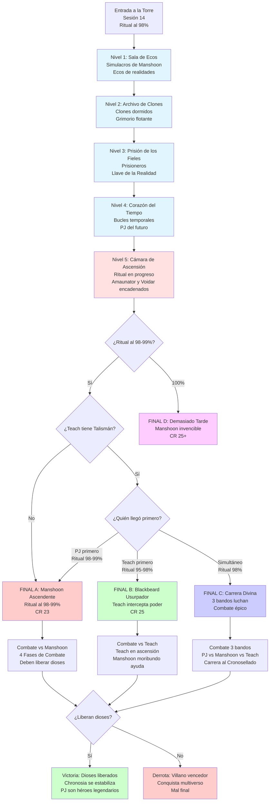

# 🏰 Torre de la Eternidad
## *Asalto Final y Los Cuatro Finales*

---

> **📖 NAVEGACIÓN:**
> - [← Volver al Diagrama Principal](../00_Esquema_Campana_Mermaid.md)
> - [📊 Opciones en Sandbox](./01_Sandbox.md)
> - [⚔️ La Ascensión del Cónclave](./02_Ascension_Conclave.md)
> - [🎭 Decisiones Críticas](./04_Decisiones_Criticas.md)

---

## 🏰 **DIAGRAMA: TORRE DE LA ETERNIDAD**

Este diagrama muestra los 5 niveles del asalto final, las condiciones para cada uno de los 4 finales posibles, y las mecánicas del combate final.

---

## 📋 **INFORMACIÓN DETALLADA**

### **🏰 Los Cinco Niveles de la Torre:**

#### **Nivel 1: Sala de Ecos**
- **Encuentros:** Simulacros de Manshoon (versiones de diferentes realidades)
- **Mecánica:** Ecos de conversaciones de otras líneas temporales
- **Objetivo:** Encontrar el camino correcto entre múltiples realidades

#### **Nivel 2: Archivo de Clones**
- **Encuentros:** Clones dormidos de Manshoon (pueden despertar)
- **Tesoro:** Grimorio flotante con información sobre el ritual
- **Objetivo:** Evitar despertar a los clones o enfrentarlos estratégicamente

#### **Nivel 3: Prisión de los Fieles**
- **Encuentros:** Prisioneros leales a Manshoon (pueden ser liberados o interrogados)
- **Tesoro:** Llave de la Realidad (necesaria para liberar a los dioses)
- **Objetivo:** Obtener la llave sin alertar a Manshoon

#### **Nivel 4: Corazón del Tiempo**
- **Mecánica:** Bucles temporales donde los PJ pueden encontrarse con versiones futuras de sí mismos
- **Peligro:** Quedar atrapado en un bucle temporal
- **Objetivo:** Navegar los bucles sin quedar atrapado

#### **Nivel 5: Cámara de Ascensión**
- **Estado:** Ritual en progreso (98-100%)
- **Presentes:** Manshoon, Amaunator y Voidar encadenados
- **Objetivo:** Interrumpir el ritual y liberar a los dioses

### **⚔️ Los Cuatro Finales Posibles:**

#### **🔴 FINAL A: Manshoon Ascendente**
**Condiciones:**
- Los PJ llegan cuando el ritual está al 98-99%
- Edward Teach está ausente o fue derrotado previamente
- Manshoon está a MOMENTOS de completar la ascensión

**Combate:**
- **4 Fases:** Manshoon Mortal Potenciado → Ritual Acelera → Ascensión Parcial → El Dios Débil
- **CR 23** (Manshoon Ascendente)
- **Mecánica Crítica:** Los PJ DEBEN liberar a los dioses o perderán automáticamente

#### **🟢 FINAL B: Blackbeard el Usurpador**
**Condiciones:**
- Edward Teach tiene el Talismán de Interceptación
- Teach llega ANTES que los PJ
- El ritual está al 95-98%

**Combate:**
- **3 Fases:** Blackbeard Ascendente → El Dios Pirata → Furia Divina
- **CR 25** (Blackbeard Ascendant)
- **Giro Épico:** Manshoon cae al suelo, debilitado, y puede ayudar a los PJ

#### **🔵 FINAL C: La Carrera Divina**
**Condiciones:**
- Edward Teach y los PJ llegan SIMULTÁNEAMENTE
- El ritual está al 98%

**Combate:**
- **Mecánica Única:** Combate de tres bandos (PJ vs Manshoon vs Teach)
- **Objetivo:** Llegar primero al Cronosellado (centro del ritual)
- **Ritual avanza:** Cada 2 turnos, el ritual avanza 1%

#### **🟣 FINAL D: Demasiado Tarde**
**Condiciones:**
- Los PJ llegan cuando el ritual está al 100%
- Manshoon YA ascendió completamente

**Combate:**
- **CR 25+** (Manshoon completamente divino)
- **Casi invencible:** Los PJ solo pueden huir o sacrificarse heroicamente
- **Mal final:** El villano conquista el multiverso

### **🎯 Mecánicas del Combate Final:**

**Liberar a los Dioses:**
- **Requisito:** Llave de la Realidad (Nivel 3) + Acción de 1 turno
- **Efecto:** Amaunator y Voidar se liberan y atacan al villano
- **Crítico:** Sin liberar a los dioses, los PJ no pueden ganar

**Progresión del Ritual:**
- **Sesión 13:** Ritual al 98%
- **Sesión 14:** Ritual al 98-99% (durante el asalto)
- **Sesión 15:** Ritual al 98-100% (depende del timing)

**Edward Teach:**
- **Si tiene Talismán:** Puede llegar ANTES, DURANTE o DESPUÉS de los PJ
- **Si NO tiene Talismán:** Final B imposible

---

*El destino del multiverso se decide en estos momentos finales. Cada decisión, cada acción, cada segundo cuenta.* 🏰⚔️✨

