# 🏰 Torre de la Eternidad
## *Asalto Final y Los Cuatro Finales*

---

> **📖 NAVEGACIÓN:**
> - [← Volver al Diagrama Principal](../00_Esquema_Campana_Mermaid.md)
> - [⏳ Motor de Campaña: Reloj y Puertas](../02_Guia_DM/10_Motor_de_Campana_Reloj_y_Puertas.md)
> - [📊 Opciones en Sandbox](./01_Sandbox.md)
> - [🎭 Decisiones Críticas](./04_Decisiones_Criticas.md)

---

## 🏰 **DIAGRAMA: TORRE DE LA ETERNIDAD**

Este diagrama muestra los 4 niveles del asalto final con antesalas, la revelación masiva, y las mecánicas del combate final.

```mermaid
flowchart TD
    ENTRADA[Entrada a la Torre<br/>Sesión 14<br/>Todos los lugartenientes vivos entran] --> ANTESALA[Antesala Inicial<br/>Todos se ven y oyen<br/>No pueden atacarse<br/>Medidor del ritual visible]
    
    ANTESALA --> N1[Nivel 1: Sala de Ecos<br/>Puzzles y acertijos<br/>REVELACIÓN MASIVA<br/>Toda la verdad al descubierto]
    
    N1 --> ANTESALA2[Antesala Nivel 2<br/>Todos se ven<br/>Medidor del ritual visible]
    ANTESALA2 --> N2[Nivel 2: Casa de Manshoon<br/>Corazón del Tiempo<br/>Clones de PJs en habitaciones<br/>Tesoros: pociones/objetos mágicos]
    
    N2 --> ANTESALA3[Antesala Nivel 3<br/>Todos se ven<br/>Medidor del ritual visible]
    ANTESALA3 --> N3[Nivel 3: Eliminatoria<br/>Prueba de Voluntad<br/>CD 18 Sabiduría<br/>Teach tiene ventaja]
    
    N3 --> ANTESALA4[Antesala Nivel 4<br/>Últimos sobrevivientes<br/>Medidor del ritual visible]
    ANTESALA4 --> N4[Nivel 4: Cámara de Ascensión<br/>Manshoon ejecutando ritual<br/>Amaunator y Voidar encadenados<br/>Medidor del ritual: 0-100%]
    
    N4 --> TIMING{¿Ritual al 100%?}
    
    TIMING -->|No| COMBATE[Combate Final<br/>Manshoon + Teach + otros vivos<br/>Deben liberar dioses en 3 pasos]
    TIMING -->|Sí| FINAL_D[FINAL D: Demasiado Tarde<br/>Manshoon imparable<br/>fin de partida]
    
    COMBATE --> PASO1[Paso 1: Interrumpir Ritual<br/>Atacar Cronosellado<br/>Ritual se detiene temporalmente]
    
    PASO1 --> PASO2[Paso 2: Romper Cadenas<br/>Poder opuesto o Talismán<br/>Dioses se liberan parcialmente]
    
    PASO2 --> PASO3[Paso 3: Restaurar Equilibrio<br/>Convencer dioses o artefacto<br/>Dioses se liberan completamente]
    
    PASO3 --> VICTORIA[Victoria: Dioses liberados<br/>Chronosia se estabiliza<br/>PJ son héroes legendarios]
    
    COMBATE -->|Falla| DERROTA[Derrota: Villano vencedor<br/>Conquista multiverso<br/>Mal final]
    
    FINAL_D --> DERROTA
    
    style ANTESALA fill:#ffffcc
    style N1 fill:#e1f5ff
    style ANTESALA2 fill:#ffffcc
    style N2 fill:#e1f5ff
    style ANTESALA3 fill:#ffffcc
    style N3 fill:#ffe1e1
    style ANTESALA4 fill:#ffffcc
    style N4 fill:#ffcccc
    style COMBATE fill:#ff9999
    style PASO1 fill:#ccffcc
    style PASO2 fill:#ccffcc
    style PASO3 fill:#ccffcc
    style FINAL_D fill:#ffccff
    style VICTORIA fill:#ccffcc
    style DERROTA fill:#ffcccc
```

---

## 📋 **INFORMACIÓN DETALLADA**

### **🏰 Estructura de la Torre:**

#### **Antesala (antes de cada nivel)**
- **Mecánica:** Todos los que entraron se ven y oyen, pero **no pueden atacarse**
- **Avance:** Solo pueden avanzar al siguiente nivel cuando todos estén listos (o cuando alguien encuentra la forma de avanzar)
- **Medidor del Ritual:** Visible en cada antesala, muestra progreso 0-100%
- **Tensión:** Todos saben que el ritual avanza, creando urgencia

#### **Nivel 1: Sala de Ecos - Revelación Masiva**
- **Mecánica:** Puzzles y acertijos que revelan información
- **Revelación Completa:**
  - Aethernus = Manshoon Clone #47
  - Plan completo de ascensión divina
  - Los dioses Amaunator y Voidar están encadenados
  - El Talismán de Teach puede interceptar poder divino
  - Motivos y trasfondos de cada lugarteniente
  - La guerra civil fue orgánica, no planeada por Manshoon
- **Efecto:** Todos escuchan las revelaciones simultáneamente
- **Objetivo:** Completar los puzzles para avanzar

#### **Nivel 2: Corazón del Tiempo - Casa de Manshoon**
- **Apariencia:** Una gran mansión lujosa donde vivía Manshoon antes del ritual
- **Mecánica por Habitación:**
  - Cada habitación contiene un **tesoro** (poción u objeto mágico)
  - En cada habitación aparece un **clon de uno de los PJs** (versión distorsionada)
  - El clon intenta convencer al PJ de que se quede ("Aquí puedes ser feliz", "No necesitas luchar")
- **Peligro:** Resistir la tentación de quedarse
- **Objetivo:** Avanzar sin caer en la trampa de los clones

#### **Nivel 3: Eliminatoria**
- **Mecánica:** Prueba de Voluntad
  - Todos hacen una tirada de **Sabiduría (CD 18)**
  - **Edward Teach tiene ventaja** (usa el Talismán)
  - El que falla queda eliminado (no puede avanzar al Nivel 4)
- **Solución para Números Impares:**
  - Si hay número impar de participantes, el que falla la tirada queda fuera
  - Si todos pasan, el último en completar el Nivel 2 queda eliminado
- **Objetivo:** Superar la prueba para llegar al combate final

#### **Nivel 4: Cámara de Ascensión**
- **Estado:** Manshoon ejecutando el ritual de ascensión
- **Presentes:** 
  - Manshoon (Aethernus Valcarys) en el centro del ritual
  - Amaunator y Voidar encadenados a pilares de poder
  - Todos los que superaron el Nivel 3 (PJ, Teach, otros lugartenientes vivos)
- **Medidor del Ritual:** Visible, muestra progreso 0-100%
- **Urgencia:** Si llega a 100%, Manshoon se convierte en dios (invencible)
- **Objetivo:** Interrumpir el ritual y liberar a los dioses antes de que se complete

### **⚔️ El Combate Final:**

**Participantes:**
- **Manshoon (Aethernus Valcarys):** Ejecutando el ritual, CR 13-14 según la fase del combate
- **Edward Teach:** Siempre presente (tiene el Talismán), puede ayudar o interferir
- **Otros Lugartenientes Vivos:** 
  - Si están aliados con los PJ → Actúan como NPCs aliados
  - Si son enemigos → Pueden aparecer como refuerzos de Manshoon o como tercer bando
- **Los PJ:** Deben liberar a los dioses para ganar

**Medidor del Ritual:**
- Visible en todo momento durante el combate
- Si llega a **100%**, Manshoon se convierte en dios (imparable: fin de partida)
- Avanza cada 2-3 turnos durante el combate (narrativo, no mecánico estricto)

### **🎯 Mecánica de Liberación de los Dioses (Tres Pasos):**

#### **Paso 1: Interrumpir el Ritual**
- **Acción:** Atacar el **Cronosellado** (centro del ritual)
- **Requisito:** Acción completa + tirada de ataque o hechizo
- **Efecto:** El ritual se detiene temporalmente, Manshoon se debilita
- **CD:** 20 (AC del Cronosellado) o tirada de salvación de Sabiduría CD 18
- **Crítico:** Sin interrumpir el ritual, los dioses no pueden liberarse

#### **Paso 2: Romper las Cadenas Divinas**
- **Mecánica:** Las cadenas están hechas de poder temporal y espacial combinado
- **Opción A - Poder Opuesto:**
  - Usar poder **temporal** para romper cadenas **espaciales** (de Voidar)
  - Usar poder **espacial** para romper cadenas **temporales** (de Amaunator)
  - Requiere: Acción completa + hechizo de nivel 5+ o poder equivalente
- **Opción B - Talismán de Teach:**
  - Edward Teach puede usar el Talismán para interceptar las cadenas
  - Requiere: Acción completa + voluntad de Teach (puede ayudar o traicionar)
- **Efecto:** Los dioses se liberan parcialmente, pueden ayudar limitadamente

#### **Paso 3: Restaurar el Equilibrio**
- **Problema:** Los dioses están en conflicto eterno (manipulado por Manshoon)
- **Opción A - Convencimiento:**
  - Convencer a los dioses de que cesen la lucha
  - Requiere: Acción completa + tirada de Persuasión CD 25 (muy difícil)
  - Alternativa: Varrak (si está vivo) puede usar su poder profético para mostrarles el futuro
- **Opción B - Artefacto:**
  - Usar un artefacto que restaure el equilibrio (si los PJ lo tienen)
  - Requiere: Acción completa + artefacto específico
- **Opción C - Combinación de Artefactos:**
  - **Llave de la Realidad** (si la obtuvieron) + **Talismán de Teach** + **Cristal de Varrak** (si lo tienen)
  - Usar los tres juntos = liberación automática
- **Efecto:** Los dioses se liberan completamente y restauran el equilibrio cósmico

**Consecuencias de la Liberación:**
- **Amaunator y Voidar atacan a Manshoon:** Daño masivo, debilita significativamente
- **Equilibrio Restaurado:** Chronosia comienza a estabilizarse
- **Victoria:** Los PJ ganan el combate final

**Si Falla la Liberación:**
- **Ritual se Completa:** Manshoon completa la ascensión (fin de partida)
- **Derrota:** Los PJ no pueden ganar, el multiverso cae bajo el dominio de Manshoon
- **Mal Final:** Solo pueden huir o sacrificarse heroicamente

### **🟣 FINAL D: Demasiado Tarde**
**Condiciones:**
- El medidor del ritual llega a **100%** antes de que los PJ liberen a los dioses
- Manshoon YA ascendió completamente

**Combate:**
- **Imparable** (Manshoon completamente divino: derrota narrativa)
- **Casi invencible:** Los PJ solo pueden huir o sacrificarse heroicamente
- **Mal final:** El villano conquista el multiverso

---

*El destino del multiverso se decide en estos momentos finales. Cada decisión, cada acción, cada segundo cuenta.* 🏰⚔️✨

