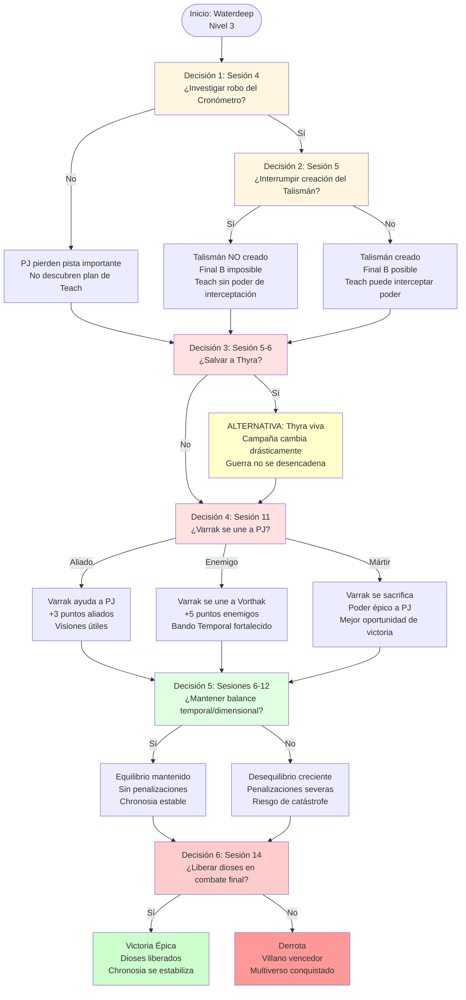

# 🎭 Decisiones Críticas
## *Puntos de Elección que Determinan el Destino*

---

> **📖 NAVEGACIÓN:**
> - [← Volver al Diagrama Principal](../00_Esquema_Campana_Mermaid.md)
> - [📊 Opciones en Sandbox](./01_Sandbox.md)
> - [⚔️ La Ascensión del Cónclave](./02_Ascension_Conclave.md)
> - [🏰 Torre de la Eternidad](./03_Torre_Eternidad.md)

---

## 🎭 **DIAGRAMA: DECISIONES CRÍTICAS**

Este diagrama muestra los 6 puntos de decisión más importantes de la campaña, cada uno con consecuencias que afectan directamente el desenlace final.

---

## 📋 **INFORMACIÓN DETALLADA**

### **🎯 Los 6 Puntos de Decisión Crítica:**

#### **1️⃣ Decisión 1: Sesión 4 - ¿Investigar el robo del Cronómetro?**

**Contexto:**
- Edward Teach roba el Cronómetro de Realidades de los Anacronistas
- Los PJ son sospechosos del robo (conocían su ubicación)

**Opciones:**
- **Sí - Investigar:** Descubren el plan de Teach, pueden seguir el rastro
- **No - Ignorar:** Pierden pista importante, no descubren el plan completo

**Consecuencias:**
- **Si investigan:** Pueden llegar a tiempo para la Decisión 2
- **Si no investigan:** Pierden oportunidad de interrumpir el Talismán

---

#### **2️⃣ Decisión 2: Sesión 5 - ¿Interrumpir la creación del Talismán?**

**Contexto:**
- Edward Teach está ejecutando un ritual de 1 hora para combinar el Cronómetro y la Perla
- Los PJ pueden llegar a tiempo si investigaron en la Decisión 1

**Opciones:**
- **Sí - Interrumpir:** Combate épico vs Edward Teach (CR 17) + 6 piratas élite
- **No - Llegar tarde:** Teach completa el Talismán, Final B se vuelve posible

**Consecuencias:**
- **Si interrumpen:** Talismán NO creado → Final B imposible
- **Si no interrumpen:** Talismán creado → Final B posible

**Impacto:** Esta decisión determina si Edward Teach puede convertirse en el villano final alternativo.

---

#### **3️⃣ Decisión 3: Sesión 5-6 - ¿Salvar a Thyra?**

**Contexto:**
- Edward Teach está a punto de asesinar a Thyra la Suspendida
- Los PJ pueden llegar durante el asesinato si actuaron rápido

**Opciones:**
- **Sí - Salvar:** Thyra sobrevive, la guerra no se desencadena, campaña cambia drásticamente
- **No - Llegar tarde:** Thyra muere, guerra espontánea comienza (evento fijo)

**Consecuencias:**
- **Si salvan:** Alternativa completa - La Ascensión del Cónclave no ocurre
- **Si no salvan:** Evento fijo - Guerra espontánea desencadenada

**Impacto:** Esta es la decisión más importante de la campaña. Salvar a Thyra cambia completamente la narrativa.

---

#### **4️⃣ Decisión 4: Sesión 11 - ¿Varrak se une a los PJ?**

**Contexto:**
- Varrak del Horizonte está en crisis existencial tras el asesinato de Thyra
- Debe elegir entre tres caminos según las acciones de los PJ

**Opciones:**
- **Aliado Reticente:** Varrak se une a los PJ, +3 puntos aliados, visiones útiles
- **Servidor Fiel:** Varrak se une a Vorthak, +5 puntos enemigos, Bando Temporal fortalecido
- **Mártir Quebrado:** Varrak se sacrifica, poder épico a los PJ, mejor oportunidad de victoria

**Consecuencias:**
- **Aliado:** Ayuda constante, pero con dudas
- **Enemigo:** Bando Temporal se vuelve más peligroso
- **Mártir:** Sacrificio épico, pero mejor oportunidad de victoria

**Impacto:** Determina si los PJ tienen un aliado poderoso o un enemigo adicional en el clímax.

---

#### **5️⃣ Decisión 5: Sesiones 6-12 - ¿Mantener el balance temporal/dimensional?**

**Contexto:**
- Los PJ deben derrotar lugartenientes manteniendo equilibrio entre temporales y dimensionales
- El desequilibrio causa penalizaciones crecientes

**Opciones:**
- **Sí - Mantener equilibrio:** Sin penalizaciones, Chronosia estable
- **No - Desequilibrar:** Penalizaciones severas, riesgo de catástrofe cósmica

**Consecuencias:**
- **Equilibrio:** Todo funciona normalmente
- **Desequilibrio 2:** Desbalance Menor (1d4 efectos/sesión)
- **Desequilibrio 3:** Desbalance Moderado (1d6 efectos/sesión)
- **Desequilibrio 4+:** Desbalance Crítico (1d8 efectos/sesión)

**Impacto:** Afecta directamente la jugabilidad y la dificultad de la campaña.

---

#### **6️⃣ Decisión 6: Sesión 14 - ¿Liberar a los dioses en el combate final?**

**Contexto:**
- Los PJ están en el combate final contra el villano
- Tienen la Llave de la Realidad (obtenida en Nivel 3 de la Torre)
- Pueden liberar a Amaunator y Voidar con una acción

**Opciones:**
- **Sí - Liberar:** Los dioses atacan al villano, los PJ tienen oportunidad de victoria
- **No - No liberar:** El villano es casi invencible, derrota casi garantizada

**Consecuencias:**
- **Si liberan:** Victoria posible - Los dioses debilitan al villano
- **Si no liberan:** Derrota casi garantizada - El villano es demasiado poderoso

**Impacto:** Esta es la decisión final que determina si los PJ ganan o pierden.

---

## 🎯 **Árbol de Consecuencias:**

**Ruta Óptima (Mayor probabilidad de victoria):**
1. ✅ Investigar el robo del Cronómetro
2. ✅ Interrumpir la creación del Talismán (o llegar tarde pero prepararse)
3. ❌ No salvar a Thyra (permite que la guerra se desencadene - necesario para narrativa)
4. ✅ Varrak como Mártir (mejor oportunidad de victoria)
5. ✅ Mantener equilibrio temporal/dimensional
6. ✅ Liberar a los dioses en el combate final

**Ruta Alternativa (Thyra viva):**
1. ✅ Investigar el robo
2. ✅ Interrumpir el Talismán
3. ✅ Salvar a Thyra
4. ⚠️ Campaña cambia completamente - La Ascensión del Cónclave no ocurre

---

*Cada decisión importa. Cada elección tiene peso. El destino del multiverso está en vuestras manos.* 🎭⚔️✨

