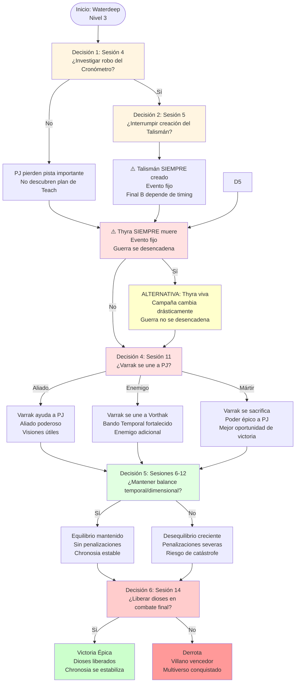

# 🎭 Decisiones Críticas
## *Puntos de Elección que Determinan el Destino*

---

> **📖 NAVEGACIÓN:**
> - [← Volver al Diagrama Principal](../00_Esquema_Campana_Mermaid.md)
> - [📊 Opciones en Sandbox](./01_Sandbox.md)
> - [⚔️ Sistema Dinámico de Lugartenientes](./02_Ascension_Conclave.md) ⚠️ OBSOLETO
> - [🏰 Torre de la Eternidad](./03_Torre_Eternidad.md)

---

## 🎭 **DIAGRAMA: DECISIONES CRÍTICAS**

Este diagrama muestra los 6 puntos de decisión más importantes de la campaña, cada uno con consecuencias que afectan directamente el desenlace final.

---

## 📋 **INFORMACIÓN DETALLADA**

### **🎯 Los 6 Puntos de Decisión Crítica:**

#### **1️⃣ Decisión 1: Sesión 4 - ¿Investigar el robo del Cronómetro?**

**Contexto:**
- Edward Teach roba el Cronómetro de Realidades de los Anacronistas
- Los PJ son sospechosos del robo (conocían su ubicación)

**Opciones:**
- **Sí - Investigar:** Descubren el plan de Teach, pueden seguir el rastro
- **No - Ignorar:** Pierden pista importante, no descubren el plan completo

**Consecuencias:**
- **Si investigan:** Pueden llegar a tiempo para la Decisión 2
- **Si no investigan:** Pierden oportunidad de interrumpir el Talismán

---

#### **2️⃣ Sesión 5 - Creación del Talismán (Evento Fijo)**

**⚠️ EVENTO FIJO: El Talismán SIEMPRE se crea**

**Contexto:**
- Edward Teach está ejecutando un ritual de 1 hora para combinar el Cronómetro y la Perla
- Los PJ pueden llegar a tiempo si investigaron en la Decisión 1

**Opciones:**
- **Intentar Interrumpir:** Combate épico vs Edward Teach (CR 17) + 6 piratas élite
- **No Interrumpir / Llegar Tarde:** Teach completa el Talismán sin oposición

**⚠️ IMPORTANTE:**
- **El Talismán se crea de todas formas** - Aunque los PJ interrumpan, Teach lo completa después o durante el combate
- **Consecuencias de interrumpir:** Pueden debilitar a Teach, ganar información, o retrasar el proceso
- **Final B depende del timing:** Si Teach llega primero a la Torre, usa el Talismán (Final B)

**Impacto:** Aunque el Talismán siempre se crea, las acciones de los PJ afectan el timing del asalto final y la relación con Teach.

---

#### **3️⃣ Sesión 5-6 - Asesinato de Thyra (Evento Fijo)**

**⚠️ EVENTO FIJO: Thyra SIEMPRE muere**

**Contexto:**
- Edward Teach está a punto de asesinar a Thyra la Suspendida
- Los PJ pueden llegar durante el asesinato si actuaron rápido

**Opciones:**
- **Intentar Prevenir:** Combate épico vs Edward Teach (CR 17 con Talismán) + Thyra como aliada temporal
- **Llegar Tarde:** Thyra muerta, guerra espontánea comienza (evento fijo)

**⚠️ IMPORTANTE:**
- **Thyra muere de todas formas** - Aunque los PJ intenten salvarla, el asesinato ocurre inevitablemente
- **Consecuencias de intentar prevenir:** Pueden debilitar a Teach, ganar información, o retrasar el proceso
- **Evento Fijo:** La guerra espontánea se desencadena de todas formas

**Impacto:** Aunque Thyra siempre muere, las acciones de los PJ afectan el estado de Teach y la preparación para el clímax.

---

#### **4️⃣ Decisión 4: Sesión 11 - ¿Varrak se une a los PJ?**

**Contexto:**
- Varrak del Horizonte está en crisis existencial tras el asesinato de Thyra
- Debe elegir entre tres caminos según las acciones de los PJ

**Opciones:**
- **Aliado Reticente:** Varrak se une a los PJ, aliado poderoso, visiones útiles
- **Servidor Fiel:** Varrak se une a Vorthak, Bando Temporal fortalecido, enemigo adicional
- **Mártir Quebrado:** Varrak se sacrifica, poder épico a los PJ, mejor oportunidad de victoria

**Consecuencias:**
- **Aliado:** Ayuda constante, pero con dudas
- **Enemigo:** Bando Temporal se vuelve más peligroso
- **Mártir:** Sacrificio épico, pero mejor oportunidad de victoria

**Impacto:** Determina si los PJ tienen un aliado poderoso o un enemigo adicional en el clímax.

---

#### **5️⃣ Decisión 5: Sesiones 6-12 - ¿Mantener el balance temporal/dimensional?**

**Contexto:**
- Los PJ deben derrotar lugartenientes manteniendo equilibrio entre temporales y dimensionales
- El desequilibrio causa penalizaciones crecientes

**Opciones:**
- **Sí - Mantener equilibrio:** Sin penalizaciones, Chronosia estable
- **No - Desequilibrar:** Penalizaciones severas, riesgo de catástrofe cósmica

**Consecuencias:**
- **Equilibrio (Diferencia 0-1):** Todo funciona normalmente, sin efectos
- **Desbalance (Diferencia 2+):** 1d4 efectos por sesión al inicio
- **⚠️ NOTA:** Si el desbalance es extremo (diferencia 4+), Varrak puede sacrificarse voluntariamente para equilibrar

**Impacto:** Afecta directamente la jugabilidad y la dificultad de la campaña.

---

#### **6️⃣ Decisión 6: Sesión 14 - ¿Liberar a los dioses en el combate final?**

**Contexto:**
- Los PJ están en el combate final contra el villano
- Tienen la Llave de la Realidad (obtenida en Nivel 3 de la Torre)
- Pueden liberar a Amaunator y Voidar con una acción

**Opciones:**
- **Sí - Liberar:** Los dioses atacan al villano, los PJ tienen oportunidad de victoria
- **No - No liberar:** El villano es casi invencible, derrota casi garantizada

**Consecuencias:**
- **Si liberan:** Victoria posible - Los dioses debilitan al villano
- **Si no liberan:** Derrota casi garantizada - El villano es demasiado poderoso

**Impacto:** Esta es la decisión final que determina si los PJ ganan o pierden.

---

## 🎯 **Árbol de Consecuencias:**

**Ruta Óptima (Mayor probabilidad de victoria):**
1. ✅ Investigar el robo del Cronómetro
2. ⚠️ Intentar interrumpir el Talismán (aunque siempre se crea, pueden debilitar a Teach)
3. ⚠️ Intentar prevenir el asesinato de Thyra (aunque siempre muere, pueden debilitar a Teach)
4. ✅ Varrak como Mártir (mejor oportunidad de victoria)
5. ✅ Mantener equilibrio temporal/dimensional
6. ✅ Liberar a los dioses en el combate final

**Ruta Alternativa (Thyra viva):**
1. ✅ Investigar el robo
2. ✅ Interrumpir el Talismán
3. ⚠️ Intentar prevenir el asesinato de Thyra (aunque siempre muere)
4. ⚠️ Campaña cambia completamente - La Ascensión del Cónclave no ocurre

---

*Cada decisión importa. Cada elección tiene peso. El destino del multiverso está en vuestras manos.* 🎭⚔️✨

