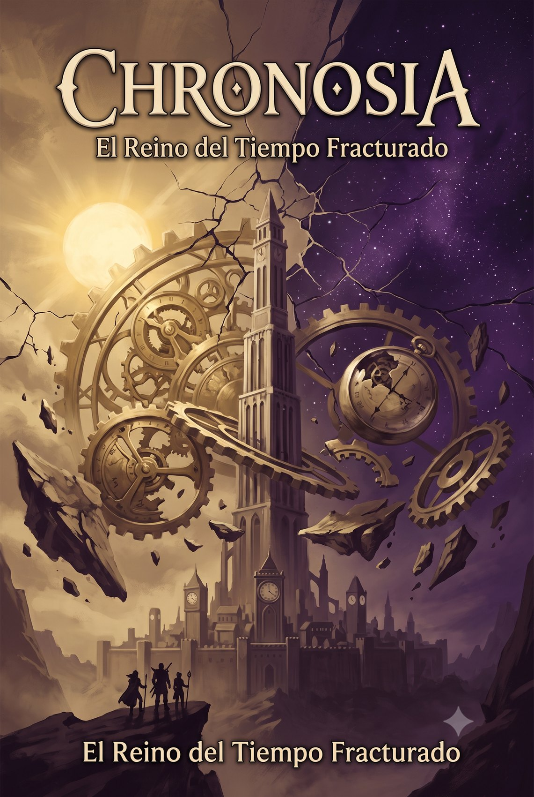

# Chronosia — El Reino del Tiempo Fracturado

{ width="480" }

> Campaña de D&D 5e · nivel 3→10 · sandbox con reloj y clímax en la Torre de la Eternidad.

!!! warning "Manual del DM — contiene spoilers"
    Esta web es la guía del **Director de Juego**. Si eres jugador, no sigas leyendo.

## Por dónde empezar

- **[Índice de la campaña](00_Indice_Campana.md)** — mapa completo de documentos.
- **[Resumen de la campaña](01_Introduccion/01_Resumen_Campana.md)** — el argumento en breve.
- **[⏳ Motor de Campaña: Reloj y Puertas](02_Guia_DM/10_Motor_de_Campana_Reloj_y_Puertas.md)** — la fuente de verdad: cómo funciona el reloj, el gating de regiones y los villanos.
- **[Dirigir la campaña](02_Guia_DM/01_Dirigir_Campana.md)** — guía rápida de mesa.

## Secciones

- **Introducción** — tono, ambientación, creación de personajes.
- **Guía del DM** — motor de campaña, cronología, NPCs, facciones y lugartenientes.
- **Regiones** — geografía y zonas de Chronosia.
- **Aventuras** — estructura por fases y prep de sesiones (Fases 0-4).
- **Apéndices** — bestiario regional y monstruos.
- **Recursos** — tablas, objetos mágicos y handouts.

---

*Usa el buscador (arriba) o el árbol de navegación (izquierda) para moverte por el contenido.*
