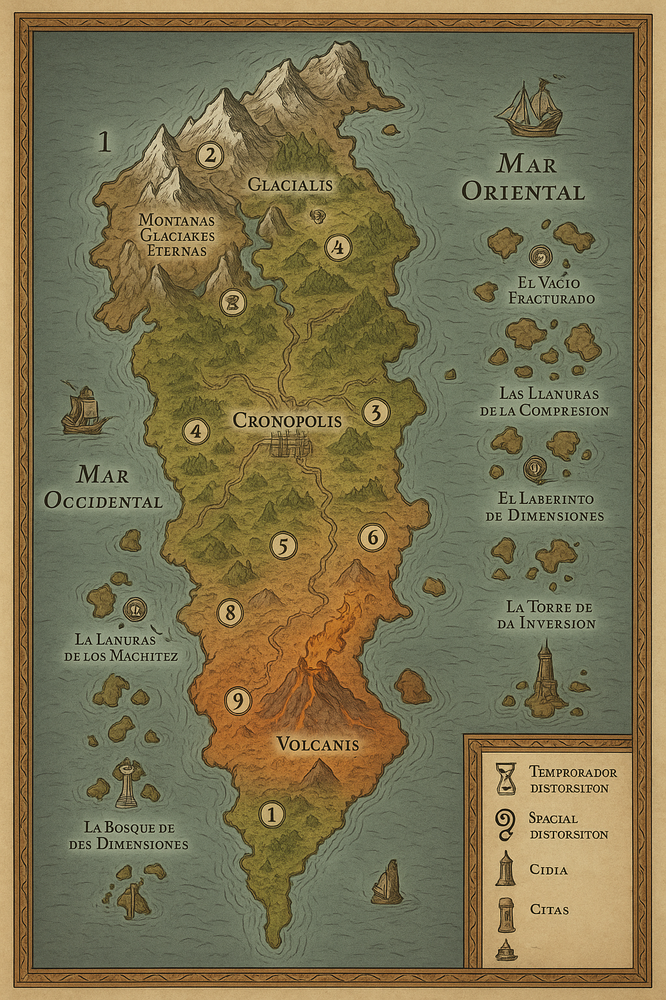

# 🎲 Dungeon Master Ultimate Assistant (DMUA)
## *Campaña de D&D: El Semiplano de la Paradoja Temporal y Espacial*

---

## 📖 **Descripción General**

Esta campaña de D&D 5ª Edición presenta una aventura épica en un mundo donde el tiempo y el espacio se han fracturado, creando un semiplano de paradojas temporales y espaciales. Los jugadores se embarcarán en una misión para restaurar el equilibrio cósmico mientras enfrentan a poderosos lugartenientes y descubren los secretos de una conspiración que amenaza la realidad misma.

### **🎯 Tema Central**
- **Conflicto Divino**: Batalla entre Amaunator (dios del tiempo) y Voidar (dios del espacio)
- **Manipulación Temporal**: Efectos de estasis, reversión, aceleración y fragmentación
- **Distorsión Espacial**: Fracturas dimensionales, compresión espacial y portales
- **Conspiración Multiversal**: Manshoon como el verdadero villano detrás de todo

---

## 🗺️ **Geografía del Mundo**

### **Continente Central**
- **Extensión**: 200 millas de ancho × 300 millas de largo
- **Mares Laterales**: Mar Oriental y Mar Occidental (conectados mágicamente)
- **Gradiente Climático**: Norte frío → Centro templado → Sur caliente

### **Ciudades Principales**
- **🏰 Cronopolis** (Centro): Ciudad principal de 15,000 habitantes - Menos afectada por distorsiones
- **🏔️ Glacialis** (Norte): Ciudad de hielo de 8,000 habitantes - Afectada por distorsiones temporales
- **🌋 Volcanis** (Sur): Ciudad volcánica de 6,000 habitantes - Atrapada en bucle temporal

---

## 📚 **Estructura de la Campaña**

### **📋 Documentos Principales**

| Archivo | Descripción | Contenido Principal |
|---------|-------------|-------------------|
| **[01_Campaña_Principal.md](01_Campaña_Principal.md)** | Visión general y estructura | Resumen, objetivos, motivaciones, localizaciones clave |
| **[02_Antagonistas_Villanos.md](02_Antagonistas_Villanos.md)** | Villanos y lugartenientes | Aethernus Valcarys, 12 lugartenientes, dioses en conflicto |
| **[03_Facciones_Grupos.md](03_Facciones_Grupos.md)** | Facciones y sus dinámicas | Cronófagos, La Resistencia, Anacronistas, Bregan D'aerthe |
| **[04_Mecanicas_Temporales.md](04_Mecanicas_Temporales.md)** | Reglas y efectos temporales | Mecánicas de juego, efectos específicos, tablas de eventos |
| **[05_Regiones_Lugares.md](05_Regiones_Lugares.md)** | Regiones del semiplano | 12 regiones dominadas por lugartenientes, geografía detallada |
| **[06_Eventos_Tablas.md](06_Eventos_Tablas.md)** | Eventos aleatorios y tablas | Eventos temporales, espaciales, tablas de paradojas |
| **[07_NPCs_Personajes.md](07_NPCs_Personajes.md)** | Personajes detallados | NPCs de Faerûn, personajes únicos del semiplano |
| **[08_Mision_1_Festival_Reloj.md](08_Mision_1_Festival_Reloj.md)** | Primera misión completa | Festival en Waterdeep, asesinato, investigación, transición al semiplano |

### **📊 Documentos de Referencia**

| Archivo | Descripción | Contenido Principal |
|---------|-------------|-------------------|
| **[00_Indice_Personajes_Regiones.md](00_Indice_Personajes_Regiones.md)** | Índice completo | Referencia rápida de personajes, regiones y mecánicas |
| **[assets/09_Prompt_Mapa_ChatGPT.md](assets/09_Prompt_Mapa_ChatGPT.md)** | Prompt para mapa | Instrucciones para generar mapa visual con IA |

---

## ⚔️ **Los Doce Lugartenientes**

### **Lugartenientes Temporales** (Poder de Amaunator)
1. **Thyra la Suspendida** - Valle de la Aguja Suspendida (Estasis)
2. **Serapis el Retroceso** - La Espiral Inversa (Reversión)
3. **Kaelith el Último Segundo** - Las Llanuras de la Marchitez (Aceleración)
4. **Varrak del Horizonte** - El Abismo de los Posibles (Fragmentación)
5. **Eira de los Ecos** - La Torre de los Ecos Perdidos (Recuerdos y Profecías)
6. **Nym la Cadena de Plata** - La Herida Invertida (Pinza Temporal)

### **Lugartenientes Espaciales** (Poder de Voidar)
7. **Vexaris el Desplazado** - El Vacío Fracturado (Distorsión Espacial)
8. **Dimensionalis la Fracturada** - Las Llanuras de la Compresión (Espacio Comprimido)
9. **Spatium el Compresor** - El Laberinto de Dimensiones (Portales)
10. **Voidara la Vacía** - La Ciudad de los Espejos (Reflexión Dimensional)
11. **Nexus el Conector** - El Bosque de las Dimensiones (Conexión Dimensional)
12. **Vortex el Invertido** - La Torre de la Inversión (Inversión Espacial)

---

## 🎭 **Facciones Principales**

### **Los Cronófagos** (Devoradores del Tiempo y el Espacio)
- **Filosofía**: Sufrir distorsiones temporales y espaciales es un don divino
- **Tipos**: 6 arquetipos diferentes (temporales y espaciales)
- **Líder**: Aethernus Valcarys (Manshoon Clone #47)

### **Los La Resistencia**
- **Filosofía**: Odian la magia temporal y espacial, buscan preservar el flujo natural
- **Características**: Tecnología anti-magia, armas de fuego, métodos brutales

### **Los Anacronistas**
- **Filosofía**: Preservar el equilibrio natural del tiempo y el espacio
- **Características**: Resistencia a distorsiones, conocimiento de estabilización

### **Bregan D'aerthe**
- **Filosofía**: Mercenarios contratados por Manshoon
- **Características**: Infiltrados en todas las facciones, operaciones especiales

---

## ⚠️ **Mecánicas Críticas**

### **Mecánica de Balance Crítico**
Los PJ deben derrotar a los lugartenientes manteniendo un equilibrio entre poderes temporales y espaciales:
- **Desbalance de 2+ derrotas** causa **Catástrofe Cósmica**
- **Más temporales**: Amaunator prevalece, tiempo se congela
- **Más espaciales**: Voidar prevalece, espacio se colapsa

### **Sistema de Recompensas**
- **Temporales**: Poder de Amaunator, longevidad, resistencia temporal
- **Espaciales**: Poder de Voidar, trascendencia dimensional, resistencia espacial
- **Generales**: Ascenso de rango, poder combinado

---

## 🎯 **Objetivos de la Campaña**

### **Objetivo Principal**
Derrotar a Aethernus Valcarys y restaurar el equilibrio entre Amaunator y Voidar, evitando la catástrofe cósmica.

### **Objetivos Secundarios**
- Derrotar a los 12 lugartenientes manteniendo el balance
- Descubrir la verdadera identidad de Aethernus (Manshoon Clone #47)
- Liberar a los dioses de su conflicto forzado
- Restaurar la estabilidad temporal y espacial del semiplano

---

## 🚀 **Cómo Empezar**

### **Para el DM**
1. Lee **[01_Campaña_Principal.md](01_Campaña_Principal.md)** para entender la estructura general
2. Revisa **[08_Mision_1_Festival_Reloj.md](08_Mision_1_Festival_Reloj.md)** para la primera sesión
3. Consulta **[00_Indice_Personajes_Regiones.md](00_Indice_Personajes_Regiones.md)** como referencia rápida
4. Usa **[assets/09_Prompt_Mapa_ChatGPT.md](assets/09_Prompt_Mapa_ChatGPT.md)** para generar mapas visuales

### **Para los Jugadores**
- La campaña comienza en Waterdeep durante el Festival del Reloj Astronómico
- Los PJ son contratados para investigar el asesinato del Maestro Thaddeus Ironwright
- La investigación los llevará al Semiplano de la Paradoja Temporal y Espacial

---

## 📝 **Notas de Diseño**

### **Inspiración**
- **Barovia**: Estética de mundo cerrado y contenido
- **Reloj de Praga**: Inspiración para el festival inicial
- **Manshoon**: Villano clásico de D&D como maestro de la conspiración
- **Amaunator y Voidar**: Dioses de D&D adaptados para el conflicto central

### **Elementos Únicos**
- **Balance Crítico**: Mecánica que obliga a los PJ a planificar estratégicamente
- **Geografía Coherente**: Mundo con lógica interna y progresión climática
- **Conspiración Multinivel**: Revelaciones que cambian la perspectiva de la campaña
- **Distorsiones Duales**: Efectos temporales y espaciales que se complementan

---

## 🔗 **Enlaces Útiles**

- **[Índice Completo](00_Indice_Personajes_Regiones.md)** - Referencia rápida
- **[Primera Misión](08_Mision_1_Festival_Reloj.md)** - Comenzar la campaña
- **[Prompt para Mapa](assets/09_Prompt_Mapa_ChatGPT.md)** - Generar mapas visuales
- **[Mecánicas Temporales](04_Mecanicas_Temporales.md)** - Reglas de juego

---

## 📊 **Estadísticas de la Campaña**

- **Duración Estimada**: 15-20 sesiones
- **Nivel de Inicio**: 3-5
- **Nivel Final**: 12-15
- **Regiones**: 12 dominadas por lugartenientes
- **Ciudades**: 3 principales + pueblos menores
- **Facciones**: 4 principales en conflicto
- **Lugartenientes**: 12 (6 temporales + 6 espaciales)

---

*Esta campaña está diseñada para ser una experiencia épica e inmersiva que combine elementos clásicos de D&D con mecánicas innovadoras de manipulación temporal y espacial. ¡Que disfrutes dirigiendo esta aventura!*

---

## 🎲 **Dungeon Master Ultimate Assistant (DMUA)**
*Agente Personalizado para Campañas de D&D*
